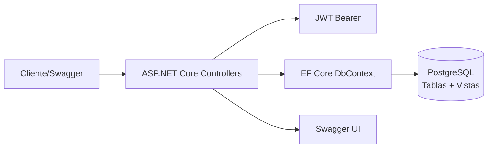

# Magnetron Billing API

API de facturación en .NET 8 con PostgreSQL, Entity Framework Core y JWT. Expone CRUD para personas, productos y facturas, además de reportes basados en vistas SQL.

## Contenidos
- Descripción general
- Arquitectura y componentes
- Estructura del proyecto
- Requisitos y configuración (.env)
- Ejecución (local y Docker)
- Documentación y endpoints
- Modelo de datos y reglas

## Descripción General

- Backend en ASP.NET Core 8 (Controllers) con Swagger para documentación.
- Acceso a datos con EF Core (Npgsql) contra PostgreSQL.
- Autenticación JWT (login/register básicos) con validación de token.
- Reportes mediante vistas SQL mapeadas como entidades sin clave.

## Arquitectura



Componentes principales:
- API: `AuthController`, `PersonasController`, `ProductosController`, `FacturasController`, `ReportesController`.
- Seguridad: JWT Bearer; configuración en `JwtSettings` y variables `.env`.
- Datos: `BillingDbContext` mapea tablas y vistas; consultas asíncronas con EF Core.
- Documentación: Swagger habilitado en Development (ruta raíz `/`).

## Estructura del Proyecto

```
MagnetronTecnicalTest/
├─ MagnetronTecnicalTest/                 # Proyecto API
│  ├─ Controllers/                        # Auth, Personas, Productos, Facturas, Reportes
│  ├─ Data/                               # BillingDbContext + entidades y vistas
│  ├─ Dtos/                               # DTOs de entrada/salida
│  ├─ Config/                             # JwtSettings
│  ├─ Program.cs                          # Startup, JWT, Swagger, DbContext
│  └─ .env                                # Variables de entorno (requerido)
├─ MagnetronTecnicalTest.Tests/           # Proyecto de tests
├─ build-and-run.ps1 | run-tests.ps1 | coverage.ps1
├─ docker-compose.yml | Dockerfile | .dockerignore
└─ README.md
```

## Requisitos

- .NET 8 SDK
- PostgreSQL 14+ (local) o Docker Desktop (si usas docker-compose)
- PowerShell (para scripts en Windows)

## Configuración (.env)

Crear un archivo `.env` dentro de `MagnetronTecnicalTest/MagnetronTecnicalTest` (el proyecto API). Puedes usar como guía `.env.production.example` del raíz. Variables requeridas por `Program.cs`:

```
# PostgreSQL
POSTGRES_HOST=localhost
POSTGRES_PORT=5432
POSTGRES_DB=billing_db
POSTGRES_USER=app
POSTGRES_PASSWORD=app_pwd

# JWT
JWT_SECRET=cambia-este-secreto
JWT_ISSUER=magnetron.billing.api
JWT_AUDIENCE=magnetron.billing.clients
JWT_EXP_MINUTES=60
```

Notas:
- `JWT_SECRET` puede ser cualquier cadena; internamente se normaliza a 32 bytes (SHA-256 si es corta).
- La API no crea el esquema. La base `billing_db` y las vistas deben existir previamente.

## Ejecución

Opción A — Local (DB local, API local):
- Asegura que PostgreSQL esté corriendo y que `billing_db` tenga tablas y vistas requeridas.
- Coloca `.env` en el proyecto API como se indicó.
- Ejecuta: `dotnet run --project .\MagnetronTecnicalTest\MagnetronTecnicalTest`
- Swagger: `http://localhost:8080/` (si usas compose) o en el puerto configurado por Kestrel cuando corres localmente (se muestra en consola).

Opción B — Docker Compose (solo API; PostgreSQL local en el host):
- Asegura PostgreSQL local activo en `localhost:5432` (DB `billing_db`, user `app`, pass `app_pwd`).
- La API en contenedor usa `POSTGRES_HOST=host.docker.internal`.
- Ejecuta: `./build-and-run.ps1 -Action build-and-run` o `docker compose up -d` en `MagnetronTecnicalTest/`.
- API: `http://localhost:8080`. Swagger solo aparece si `ASPNETCORE_ENVIRONMENT=Development`.

Scripts útiles (PowerShell, desde la carpeta raíz):
- Ejecutar tests: `./run-tests.ps1`
- Cobertura: `./coverage.ps1` (genera `CoverageReport/index.html`)

## Documentación y Endpoints

Autenticación (sin token):
- `POST /api/auth/register` — Registrar usuario
- `POST /api/auth/login` — Iniciar sesión y obtener JWT

Personas (requiere Bearer token):
- `GET /api/personas` — Listar
- `GET /api/personas/{id}` — Obtener por id
- `POST /api/personas` — Crear
- `PUT /api/personas/{id}` — Actualizar
- `DELETE /api/personas/{id}` — Eliminar

Productos (requiere Bearer token):
- `GET /api/productos` — Listar
- `GET /api/productos/{id}` — Obtener por id
- `POST /api/productos` — Crear
- `PUT /api/productos/{id}/precios` — Actualizar precios/costos
- `DELETE /api/productos/{id}` — Eliminar

Facturas (requiere Bearer token):
- `GET /api/facturas` — Listar (con detalles)
- `GET /api/facturas/{id}` — Obtener por id
- `POST /api/facturas` — Crear (con detalles)
- `DELETE /api/facturas/{id}` — Eliminar (cascada detalles)

Reportes (requiere Bearer token):
- `GET /api/reportes/personas-total`
- `GET /api/reportes/persona-producto-mas-caro`
- `GET /api/reportes/productos-cantidad-desc`
- `GET /api/reportes/productos-utilidad-desc`
- `GET /api/reportes/productos-margen`

Swagger/OpenAPI: habilitado en Development. Inicia la API y abre la URL mostrada en consola (o `http://localhost:8080` cuando usas docker-compose con la API publicada en ese puerto).

## Modelo de Datos y Reglas

Convenciones:
- Nombres en `snake_case` en base de datos.
- Montos y cantidades: `numeric(18,2)`.
- En detalle de factura se incluye `unit_price` y `line_total` (calculado: cantidad × unit_price).

Tablas principales (resumen):
- `persona(per_id, per_nombre, per_apellido, per_tipodocumento, per_documento [único])`
- `producto(prod_id, prod_descripcion, prod_um, prod_precio, prod_costo)`
- `fact_encabezado(fenc_id, fenc_numero [único], fenc_fecha, zper_id)`
- `fact_detalle(fdet_id, fdet_linea, fdet_cantidad, zprod_id, zfenc_id, unit_price, line_total)`
- `usuario(usr_id, usr_username [único], usr_passwordhash, usr_role)`

Vistas requeridas (mapeadas como keyless):
- `v_persona_total`, `v_persona_producto_mas_caro`, `v_productos_por_cantidad`, `v_productos_por_utilidad`, `v_productos_margen`.

Reglas destacadas de factura (validadas en `FacturasController`):
- `numero` único; `fecha` no futura; al menos un detalle.
- `linea` consecutiva desde 1 y sin duplicados.
- `cantidad` > 0; `unit_price` ≥ 0 y debe coincidir con `producto.precio` actual.

---

Sugerencias o mejoras: abrir un issue o PR. Para soporte local, verifica primero variables `.env` y conectividad a PostgreSQL.